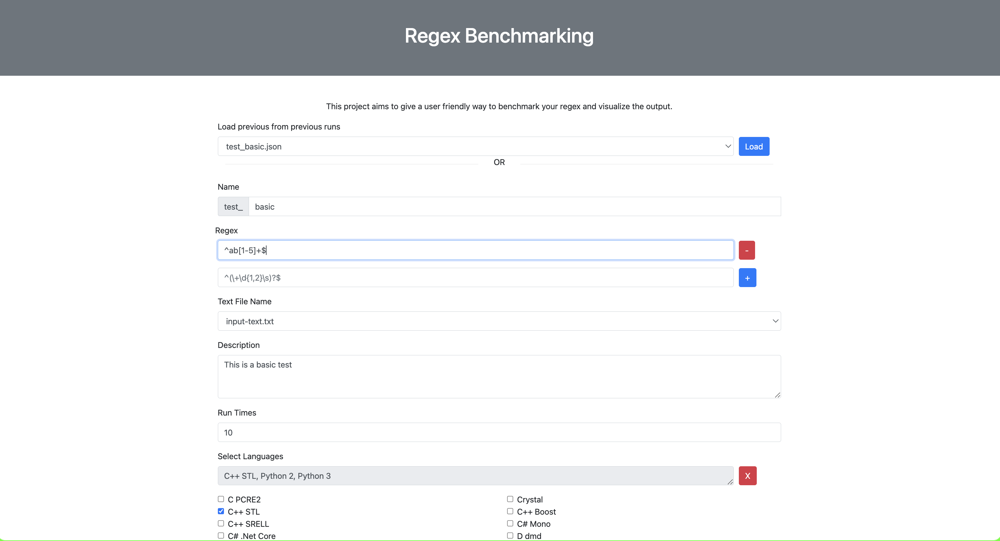

# regex-benchmark


## Build
1. Install Docker [(here)](https://docs.docker.com/engine/install/)

2. Build the docker container
```
docker build -t regex_benchmark .
```

## Run with UI
```
docker rm -f regex_benchmark_server || true && docker run -it -v $(pwd):/var/regex --name "regex_benchmark_server" -p 8000:8000 regex_benchmark
```

To open the UI after running the docker go to [http://localhost:8000](http://localhost:8000)




## Run in headless mode

Please edit the `TEST_FILE` variable in the command
```
docker rm -f regex_benchmark_server || true && docker run -it -v $(pwd):/var/regex --name "regex_benchmark_server" -p 8000:8000 -e HEADLES=true -e TEST_FILE=test_basic.json regex_benchmark
```